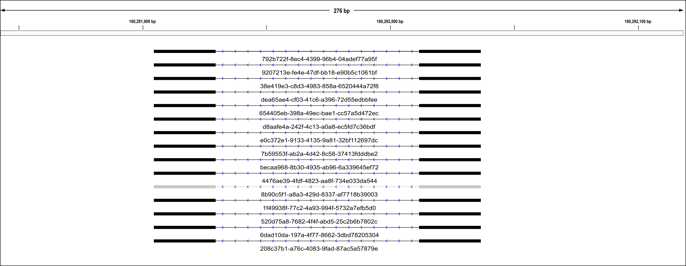

# NanoSplicer
 A program for accurately identifying splice junctions using Oxford Nanopore sequencing data.

## Keywords:
Oxford Nanopore sequencing, Transcriptomics, Splice junctions

# Overview
NanoSplicer utilises the raw ouput from nanopore sequencing (measures of electrical current commonly known as squiggles) to improve the identification of splice junctions. Instead of identifying splice junctions by mapping basecalled reads, nanosplicer compares the squiggle from a read with the predicted squiggles of potential splice junctions to identify the best match and likely junction. Mapped nanopore reads are still required in order to identify the presence of splice junctions for downstream NanoSplicer analysis. See [You et al. (2021)][NanoSplicer-bioRxiv] for more description of the method.

The program contains 3 modules `JWR_checker.py`, `JWR_subset.py` and `NanoSplicer.py`, which need to be run in order to get the final result. The first and third modules are required. `JWR_subset.py` is optional but recommended and will significantly decrease the run time of `NanoSplicer.py`.
Some example input files can be found at `example/` to run all of the modules below. Example code is also available at `example/script.sh`.

`JWR_checker.py`: Find junctions within reads (JWRs) from a spliced mapping result (BAM).

`JWR_subset.py`: Subset the result from JWR_checker. Based on our performance assessment, JWRs with high junction alignment quality (JAQ) are usually accurately mapped to their respective splice junctions. This module filters JWRs based on their JAQ, allowing selection of JWRs with lower JAQs that will most benefit from anlaysis with the NanoSplicer module. By default, `JWR_subset.py` selects JWRs with a junction alignment quality of less than 0.95.

`NanoSplicer.py`: Perform splice junction identification on the `JWR_checker.py` (or `JWR_subset.py` if applied) output. 


# Install

```
git clone https://github.com/shimlab/NanoSplicer.git
```
Use pip3 for python3 to install following dependencies:

For `JWR_checker.py` and `JWR_subset.py`:
* `pandas`
* `pysam`
* `numpy`
* `tqdm`
* `h5py`
* 'tables'

Additional requirements for `NanoSplicer`:
* `tombo`
* `ont_fast5_api`
* `matplotlib`
* `intervaltree`
* `scipy`
* `scikit-image`

**Note**: 
NanoSplicer has been tested on python 3.6 and 3.7. There might be problems when installing `tombo` with python 3.8. Downgrade to python 3.7 would resove the issues. 

## Container access
If there are any problems installing the dependencies above, an alternative way of setting up the environment is available via a container. The dependencies
required for running NanoSplicer have been packaged into a container and can be accessed using `singularity`, which is supported by most high-performance computing environments:

```
singularity pull NanoSplicer_container.sif docker://youyupei/nanosplicer:v1
```
**For people not familiar with containers**: You can run linux commands within the container by using `singularity shell` or `singularity exec`. These commands automatically bind your home directory to the home directory inside the container, which means everything under `~/` (including the sub-directories) will be accessible without extra steps. If your data are saved in a different directory, you'll need to bind the directory with `-B <local path>:<path in container>` when running `singularity shell` or `singularity exec`. For example, if your data are in `/data`, you need to add `-B /data:/folder_in_container`. Everything in `/data` is then accessible in `/folder_in_container`. You may use the same name for convenience (e.g. `-B /data:/data`). A more formal introduction to singularity can be found at https://sylabs.io/singularity/.

# Modules
All the following scripts can be found at `bin/`
## JWR_checker.py
 Find junctions within reads (JWRs) from a spliced mapping result (BAM). For each JWR, `JWR_checker` reports the junction alignment quality for the initial mapping. 
 
 **Note:** Currently `JWR_checker` outputs a table in HDF5 format, which allows easier read-in in the following steps. A CSV format table can also be output with `--output_csv`, which is easier for users to read.  The downstream scripts `JWR_subset.py` and `NanoSplicer.py` only accept HDF5 as input.
```
Finding junctions within reads (JWRs) from a spliced mapping result (BAM).

Usage: python3 JWR_checker.py [OPTIONS] <BAM file> <output hdf5 file>

Options:
    -h/--help        Print this help text
    -w/--window      Candidate search window size (nt) <default: 25>
    --chrID          Target a specific chromosome, chrID should match
                        the chromosome name in the BAM. All chromosomes
                        in the BAM will be searched if not specified
    --genome-loc     Target a specific genomic region, e.g. --genome-loc=0-10000
                        Use in conjunction with --chrID option. Entire
                        chromosome will be searched if location not specified
    --threads        Number of threads used <default: 32>.
    --output_csv     With this option, a csv file will be output along with the hdf5 file
```
### Example: find all JWRs from reads mapped to region on chromosome 1: chr1:5296679-5297165
``` 
python3 JWR_checker.py –-chrID=chr1 –-genome-loc=5296679-5297165  --output_csv input.bam example.h5
```
## JWR_subset.py
Subset the result from the JWR_checker. Based on our performance assessment, JWRs with high junction alignment quality (JAQ) are usually accurately mapped to their respective splice junctions. A subset of JWRs can be obtained by only selecting JWRs with a JAQ at or below a user-defined threshold. By default, JWR_subset.py selects all JWRs with a JAQ of 0.95 or less. **Note:** Currently `JWR_subset` only takes the HDF5 file from `JWR_checker` as input and returns the filtered subset back in HDF5 format. A table in CSV format can also be output with `--output_csv`.
```
Usage: python3 JWR_subset.py [OPTIONS] <input file: hdf5 output from JWR_checker> <output file: hdf5>
Options:
    -h/--help       Print this help text
    --JAQ_thres     A value from 0-1, only JWRs with a junction alignment quality (JAQ)
                     at or below the specified value will be retained <default: 0.95>
    --chrID         Target a specific chromosome, chrID should match
                        the chromosome name in the BAM
    --genome-loc    Target a specific genomic region, e.g. --genome-loc=0-10000
                        --chrID should be also specified.
    --output_csv    With this option, a csv file will be output along
                         with the hdf5 file
```
### Example: subset the JWRs at a specified genomic location to retain only those with a JAQ <=0.8
``` 
python3 JWR_subset.py –-chrID=chr1 –-genome-loc=5296679-5297165 --JAQ_thres=0.8  --output_csv input.h5 output.h5
```

## NanoSplicer.py
Perform splice junction identification on the JWR_checker.py (or JWR_subset.py if applied) HDF5 output.
Requires path to reads in fast5 (squiggle) format and a matched mapped .bam/.sam file for these reads. This is the same .bam file required for input into 
`JWR_checker`.
```
Usage: python3 {} [OPTIONS] <JWR_checker/JWR_subset hdf5 file>
Options:
    -i      .bam/.sam file (required)
    -f      path to fast5s (required)
    -r      Genome reference file (required)
    -o      Prefix for output files <default: './output'>.
    --threads
            Number of threads used <default: # of available cpus - 1>.

More option on the candidate splice junctions (optional):
    User-provided splice junction (from annotation or short-read mapping):
    --junction_BED      
            User-provided BED file containing known splice junctions. The BED 
            file can convert from genome annotation or short read mapping result. 
            If provided, NanoSplicer will include all splice junctions in the BED file
            as candidates with highest preference level. e.g. --junction_BED='xx.bed'
    --non_canonical_junctions
            User-provided BED file containing known splice junctions. The BED 
            file be converted from genome annotation (GTF/GFF file) or short read mapping 
            result. If provided, NanoSplicer will include non-canonical (i.e., non GT-AT) 
            splice junctions in the BED file as candidates with highest preference level.
            e.g. --non_canonical_junctions='xx.bed'
    Long-read mapping:
    --supported_junc_as_candidate
            Add nearby long read supported splice junctions as candidates (if they have 
            not been included yet).
    --min_support
            Minimum support, i.e. number of JWRs (with minimum JAQ) mapped ,for
                an additional splice junction to be added to candidate list <default: 3>
    --min_JAQ_support
            Minimum JAQ (range: 0-1) for JWRs that counted as supports. <default: 0>
```

### Example: 
``` 
python3 NanoSplicer.py -i example.bam -f /data/fast5s/ -r ref.fa input.h5
```
**Note:** The BAM file needs to be indexed (i.e. a `.bai` file needs to be present in the same folder as the BAM file). A `.bai` file can be generated with `samtools` using the command: `samtools index <BAM filename>`.

### Candidate splice junctions
There are multiple options about how to select candidate splice junctions:

By default, `NanoSplicer.py` selects:
1. The splice junction supported by the JWR (mapped splice junction).
2. Nearby canonical splice junctions. We define these as introns that start with GT and end with AG a motif present in over ∼99% of mammalian splice junctions.

Optional candidates in `NanoSplicer.py`:
1. Annotated splice junctions: Genome annotation are usually in GTF/GFF3 format, but can be converted to BED. E.g., use gffread (https://github.com/gpertea/gffread). The resulting BED file can be passed onto `NanoSplicer.py` by specifying `--junction_BED='xx.bed'`
2. User defined list of candidate splice junctions (e.g., from short-readsequencing). Some short read aligners (e.g. STAR) output a BED file containing the splice junction information. The resulting BED file can be passed onto `NanoSplicer.py` by specifying `--junction_BED='xx.bed'`

3. Nearby splice junctions supported by other mapped reads (above a user-specified read count threshold). To do this, users need to add `--supported_junc_as_candidate` in the command line.


## Output
### NanoSplicer probability table
'NanoSplicer.py' output:
*  Probability table (TSV file: \<prefix\>_prob_table.tsv), where \<prefix\> is specified by users with `-o <prefix>`.
* BED file (\<prefix\>_jwr.bed) with corrected splice junctions for each JWR.

#### Probability table
The probability table contains 10 columns:
1. **read_id**: the Nanopore id of the read that the JWR comes from
2. **reference_name**: the mapped reference name of the read the JWR comes from
3. **inital_junction**: initial mapped splice junction
4. **JAQ**: Junction alignment quality
5. **candidates**: all candidate splice junctions 
6. **candidate_sequence_motif_preference**: Based on known preferential use of specific intronic sequence patterns near splice junctions (0: *non GT-AG*, 1: *GT[C/T]-[A/G]AG*, 2: *GT[A/G]-[A/G]AG* or *GT[C/T]-AG[C/T]*, 3: *GT[A/G]-[C/T]AG* or user-provided junction)
7. **SIQ**: Squiggle information quality. The squiggle is usually of poor quality if the SIQ is lower than -0.8.
8. **prob_uniform_prior**: probability for each candidate using a uniform prior  
9. **prob_seq_pattern_prior**: probability for each candidate using the sequence pattern prior (based on the candidate sequence motif preference in column 6)
10. **best_prob**: value of the best probability in column 9

#### BED file with corrected splice junctions for each JWR
The output BED file can be visulised in genome browsers, see the following figure for the visulisation on IGV (https://software.broadinstitute.org/software/igv/). In the output, NanoSplicer presents a splice junction using two blocks (25 bases before and after the identified splice junction)). The end of the first block and the begining of the second block represent the identified splice juncitons. The blocks are colored based on the assignment probability, black: assignment probability > 0.8; grey: assignment probability<=0.8. The identifications with assignment probability <= 0.8 means there evidence in the squiggle in not strong enough, so they are usually less accurate and recommended to be discarded.


Details 
1. **chorm**: The name of the chromosome
2. **start**: The genome coordinate of the begining of the first block.
3. **end**: The genome coordinate of the end of second block.
4. **name**: read id of the read that contain the JWR 
5. **score**: Assignment probability of the splice junction. 
6. **strand**: the transcript strand
7. **thickStart**: Not in use (NanoSplicer output 0 in this columns for every JWR)
8. **thickEnd**: Not in use (NanoSplicer output 0 in this columns for every JWR)
9. **itemRgb**: The JWRs will be drawn in black if the assignment probability > 0.8, and drawn in gery otherwise.
10. **blockCount**: NanoSplicer output 0 in this columns for every JWR (NanoSplicer draw 25 bases before and after the splice junction, so there are always 2 blocks).
11. **blockSizes**: NanoSplicer output 25,25 in this columns for every JWR (NanoSplicer draw 25 bases before and after the splice junction)
12. **blockStarts**: start position of each block.

**Note:**

* The JWRs with SIQ<-0.8 are not included in the BED output, because the squiggle is usually of poor quality.
* The **start** and **end** columns (columns 2 & 3) DO NOT show the genome coordinate of the splice junctions, the exact coordinates of the splice juncitons (i.e., exon-intron boundaries) are **start+25** and **end-25**.
###  Updates coming soon
1. Visulisation module: ploting the alignment between the junction squiggle and the candidate squiggle(s).

## Known issues
1. There will be a performance warning when running `JWR_checker` and `JWR_subset`. **The warning can be ignored**. The warning is triggered when data is saved into the HDF5 file. It relates to python objects that can not be directly converted to c-type, causing non-optimal performance of the HDF5 file. 
2. The progress bar in `NanoSplicer.py` is based on the number of fast5 files that have been processed. If there is only 1 fast5 file being processed (e.g. in `example/fast5/`), the progress bar will be at 0% (0/1 completed) until the run has finished. 

## Citing NanoSplicer

If you find NanoSplcier useful for your work, please cite our paper:

> Yupei You, Michael B. Clark, Heejung Shim (2021). *NanoSplicer: Accurate identification of splice
> junctions using Oxford Nanopore sequencing.* [You et al. (2021)][NanoSplicer-bioRxiv].

[NanoSplicer-bioRxiv]: https://www.biorxiv.org/content/10.1101/2021.10.23.465402v1
