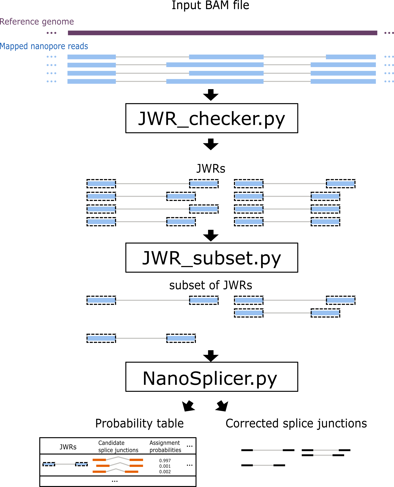

# NanoSplicer
 A program for accurately identifying splice junctions using Oxford Nanopore sequencing data (both basecalls and squiggles).

## Keywords:
Oxford Nanopore sequencing, Transcriptomics

# Overview
The program contains 3 modules and needs to be run one by one to get the final result. Some example input files can be found at `example/` to run all of the module below. Example code is also available at `example/script.sh`.

`JWR_checker.py`: Find junctions within reads (JWRs) from a spliced mapping result (BAM).

`JWR_subset.py`: Subset the result from the JWR_checker. Based on our performance assessment, JWRs with good junction alignment quality have usually an accurate mapping to the splice junctions. A subset of JWR can be obtained by only select JWRs with low JAQ. By default, `JWR_subset.py` selects the all JWRs with junction alignment quality less than 0.9.

`NanoSplicer.py`: Run the identifications on the `JWR_checker.py` (or `JWR_subset.py` if applied) output. 



# Requirements
NanoSplicer has been currently test on python 3.6 and 3.7. Everything should work for python3.X. 

## Package Dependency
For `JWR_checker.py` and `JWR_subset.py`:
* `pandas`
* `pysam`
* `numpy`
* `tqdm`
* `h5py`

Additional requirements for `NanoSplicer`:
* `tombo`
* `ont_fast5_api`
* `matplotlib`
* `fcntl`
* `intervaltree`
* `scipy`
* `skimage`

## Container access
If there is any problem install the dependency above, the alternative way of setting up the environment is available via container. The 
required for running NanoSplicer has been packaged in container and can be accessed using `singularity`, which is supported by most High-performance computer:

```
singularity pull NanoSplicer_container.sif docker://youyupei/nanosplicer:v1
```
**For poeple not familiar with container**: You can run linux command within the container by using `singularity shell` or `singularity exec`. These command autimatically bind your home directory to the home directory inside the container, which means everything under `~/` will be accessible without extra step (including the sub-directory). If your data are save in a different directory, you'll need to bind the directory with `-B <local path>:<path in container>` when running `singularity shell` or `singularity exec`. For example, your data are in `/data`, you need to add `-B /data:/folder_in_container`, everything in `/data` can then be accessible in `/folder_in_container`. You may use the same name for convenience (e.g. `-B /data:/data`). More formal introduction can be found at https://sylabs.io/singularity/

# Install

```
git clone https://github.com/shimlab/NanoSplicer.git
```

# Modules


## JWR_checker.py
 Find junctions within reads (JWRs) from a spliced mapping result (BAM). For each JWR, `JWR_checker` reports the junction alignment quality for the initial mapping. 
 
 **Note:** Currently `JWR_checker` outputs a table in HDF5 format, which allows easier read-in in the following steps. A CSV format table can also be output with `--output_csv`, which is easier for users to read.  The downstream script `JWR_subset.py` and `NanoSplicer.py` only accepts the HDF5 as the input.
```
Finding junctions within reads (JWRs) from a spliced mapping result (BAM).

Usage: python JWR_checker.py [OPTIONS] <BAM file> <output hdf5 file>

Options:
    -h/--help        Print this help text
    -w/--window      Candidate searching window size (nt) <default: 25>
    --chrID          Target on specific chromosome, chrID should match
                        the chromosome name in the BAM. All chromosomes
                        in the BAM will be searched if not specified
    --genome-loc     Target on specific genome region, chrID should be
                        specified. e.g. --genome-loc=0-10000. Entire
                        chromosome will be searched if not specified
    --threads        Number of threads used <default: 32>.
    --output_csv     With this option, a csv file will be output with the hdf5 file
```
### Example: find all JWR from reads mapped to chromosome 1 (chr1) 5296679-5297165
``` 
python3 JWR_checker.py –-chrID=chr1 –-genome-loc=5296679-5297165  --output_csv input.bam example.h5
```
## JWR_subset.py
Subset the result from the JWR_checker. Based on our performance assessment, JWRs with good junction alignment quality usually have an accurate mapping to the splice junction. A subset of JWRs can be obtained by only selecting JWRs with a low JAQ. By default, JWR_subset.py selects the all JWRs with junction alignment quality less than 0.9. **Note:** Currently `JWR_subset` only takes the HDF5 file from `JWR_checker` as input and returns the filtered subset back in HDF5 format. A table in CSV format can also be output with `--output_csv`.
```
Usage: python JWR_subset.py [OPTIONS] <input file: hdf5 output from JWR_checker> <output file: hdf5>
Options:
    -h/--help       Print this help text
    --bset_JAQ      A number from 0-1, JWRs with a junction alignment quality (JAQ) above
                     the threshold will not be included <default: 0.9>
    --chrID         Target on specific chromosome, chrID should match
                        the chromosome name in the BAM
    --genome-loc    Target on specific genome region, chrID should be
                        specified. e.g. --genome-loc=0-10000
    --output_csv    With this option, a csv file will be output with
                         the hdf5 file
```
### Example subset the JWR to retain only the JWR with junction alignment quality <=0.8 at specifiy genome location
``` 
python3 JWR_checker.py –-chrID=chr1 –-genome-loc=5296679-5297165 --best_JAQ=0.8  --output_csv input.h5 output.h5
```

## NanoSplicer.py
Run the identifications on the JWR_checker.py (or JWR_subset.py if applied) output. Note that only the HDF5 format input is accepted.
```
Usage: python NanoSplicer.py [OPTIONS] <JWR_checker/JWR_subset hdf5 file>
Options:
    -i      .bam/.sam file (required)
    -f      path to fast5s (required)
    -r      Genome reference file (required)
    -o      output filename <default: 'NanoSplicer_out'>
For developer only:
    -T      Number of events trimmed from scrappie model <default: 2>
    -t      Number of bases trimmed from raw signam, the raw samples are
                match to basecalled bases by tombo <default :6>
    -F      Flanking sequence size in each side of candidate searching
                window <default: 20>
    -w      Candidate searching window size <default: 10>
    -c      Config filename <default: 'config'>
```

### Example: 
``` 
python3 NanoSplicer.py -i example.bam -f /data/fast5s/ -r ref.fa input.h5
```
**Note:** The index file match the input BAM file need to be present in the same folder of the BAM file

## Output
The 'NanoSplicer.py' output a TSV file with 10 columns:

1. **read_id**: the id of the read that the given JWR coming from
2. **reference_name**: the mapped reference name  of the read that the given JWR coming from
3. **inital_junction**: initial mapped splice junction
4. **JAQ**: Juncion alignment quality
5. **candidates**: all candidate splice junctions 
6. **candidate_preference**: candidate preference, which is based on the sequence pattern near the splice junction, can take value 0,1,2,3. Larger value means prefered.
7. **SIQ**: Squiggle information quality The squiggle usually bad if it is lower than -0.4.
8. **prob_uniform_prior**: probability for each candidate use uniform prior  
9. **prob_seq_pattern_prior**: probability for each candidate use sequence pattern prior (based on the candidate preference in column 6)
10. **best_prob**: value of the best probability in column 9

###  Update coming soon
1. New option to output a bed file which contains the identification from NanoSplicer (We will keep the original NanoSplicer table which contains the information for all the candidates)
2. Accept user-previded BED file to guide the candidate selection
3. Option to include the mostly supported splice junction nearby as on of the candidates.
4. Visulisation module: ploting the alignment between junction squiggle and all the candidate squiggle.

## Known issue
1. There will be a performance warning when running `JWR_checker` and `JWR_subset`. **The warning can be ignored**. The warning comes when saving the data into HDF5 file. The problem is some python object can not be convert to c-type directly so the performance of the HDF5 is not optimal. 
2. The progress bar in `NanoSplicer.py` is based on the number of fast5 files has been processed. If there is only 1 fast5 file (e.g. in the `example/fast5/`), the progress bar will always be 0% (0/1 completed) until the whole run finish. 

## Contributing authors:
Yupei You,
Mike Clark*,
Heejung Shim*

## Author affiliations:
School of Mathematics and Statistics and Melbourne Integrative Genomics, University of Melbourne, Melbourne, Australia
Anatomy and Neuroscience, School of Biomedical Sciences, University of Melbourne, Melbourne, Australia
School of Mathematics and Statistics and Melbourne Integrative Genomics, University of Melbourne, Melbourne, Australia

